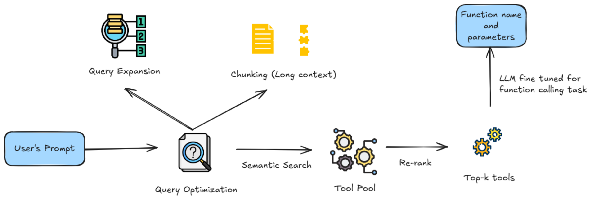
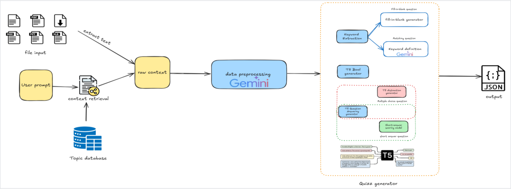
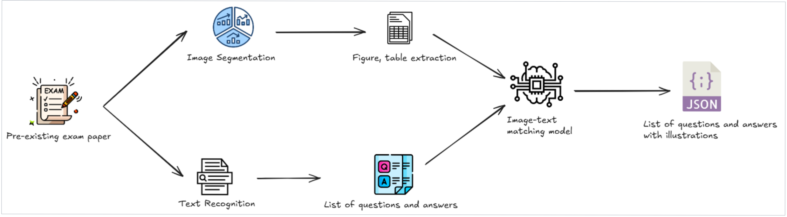
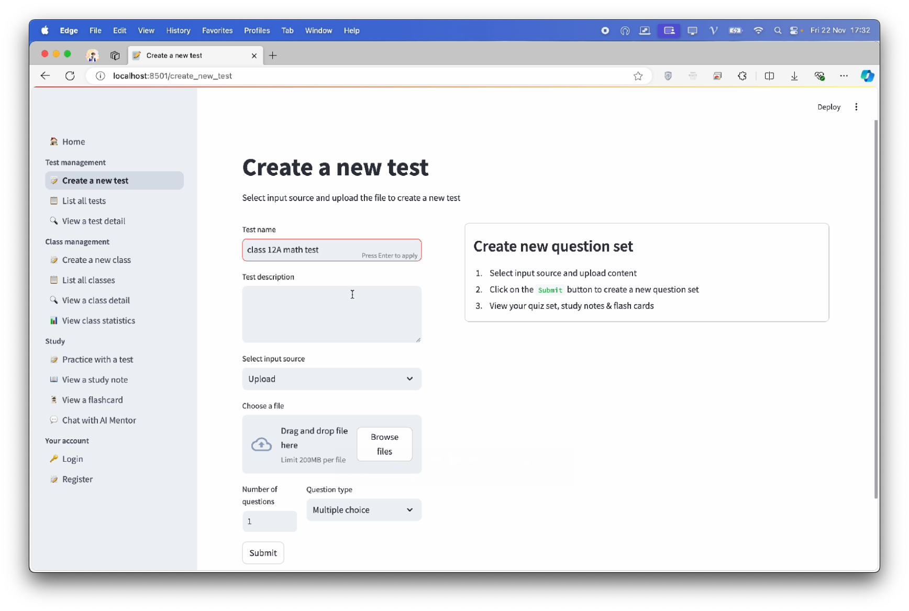
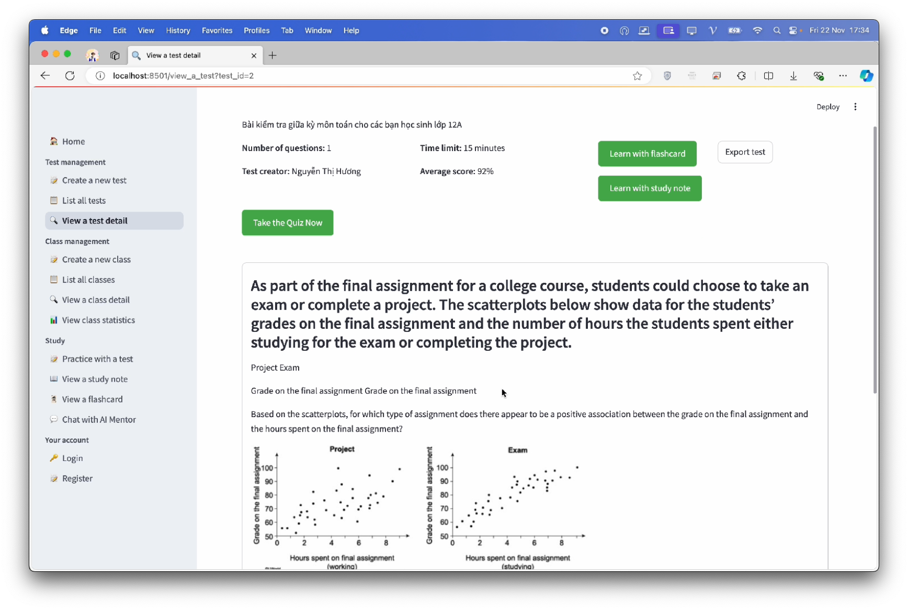

<!-- PROJECT LOGO -->
 

<h2 align="center">QuizVista</h2>

  

    Hệ thống sinh bài thi trắc nghiệm sử dụng trí tuệ nhân tạo
     
    <a href="https://github.com/huythai855/QuizVista"><strong>Explore the docs »</strong></a>
     
     
    <a href="https://github.com/huythai855/QuizVista">View Demo</a>
    ·
    <a href="https://github.com/huythai855/QuizVista/issues/new?labels=bug">Report Bug</a>
    ·
    <a href="https://github.com/huythai855/QuizVista/issues/new?labels=enhancement">Request Feature</a>
  

## Giới thiệu

<!-- [![Product Name Screen Shot][product-screenshot]](https://example.com) -->

Đã từ lâu, các bài thi trắc nghiệm từ lâu đã chứng minh hiệu quả trong giáo dục và nhiều lĩnh vực như quản lý nhân sự, phát triển kỹ năng và đào tạo chuyên nghiệp nhờ việc có thể đánh giá toàn diện, tiếp cận kiến thức phong phú hơn so với bài tự luận truyền thống.

Trên thị trường hiện nay, có rất nhiều ứng dụng hỗ trợ việc tạo các bộ câu hỏi trắc nghiệm từ file của người dùng, tuy nhiên các ứng dụng này đều gặp những hạn chế như: không h trợ nhiều định dạng file đầu vào, không trích xuất được hình ảnh, bảng biểu, độ tin cậy chưa cao, và giao diện người dùng chưa thân thiện.

QuizVista là ứng dụng đa nền tảng sử dụng các mô hình trí tuệ nhân tạo giúp người dùng sinh những bài kiểm tra trắc nghiệm nhanh chóng và hiệu quả, phù hợp cho mục đích giáo dục trong trường học và đào tạo trong doanh nghiệp. Với các tính năng nổi bật và giao diện thân thiện với người dùng QuizVista sẽ trở thành một giải pháp hữu ích cho việc giảng dạy, đào tạo và học tập.

## Kiến trúc

  
  

    High-level architecture of the components
  

  
  

    Function calling pipeline
  

  
  

    Quiz generation pipeline
  

  
  

    Exam extraction pipeline
  

## Demo

  
  

    Create a new test with multiple options of input data
  

  
  

    View a test detail
  

  
  

    Chat with AI mentor
  

## Lộ trình phát triển

- [x] Phát triển tính năng học tập
    - [x] Sinh ghi chú học tập
    - [x] Sinh thẻ ghi nhớ
    - [x] Sinh sơ đồ tư duy

- [x] Phát triển tính năng sinh bộ câu hỏi từ dữ liệu đầu vào
    - [x] Hỗ trợ đa định dạng đầu vào (Word, PDF, PowerPoint)
    - [ ] Hỗ trợ dẫn nguồn từ tài liệu chính thống (sách giáo khoa, giáo trình)
    - [ ] Cho phép chọn nội dung trong dữ liệu đầu vào thông qua prompt

    
- [x] Phát triển tính năng trích xuất
    - [x] Trích xuất bộ câu hỏi từ tài liệu của người dùng
    - [x] Trích xuất hình ảnh và bảng biểu từ tài liệu

- [x] Phát triển tính năng chia sẻ và quản lý thống kê
    - [x] Tiến trình học tập
    - [x] Thống kê bài kiểm tra được tạo
    - [ ] Xuất bộ câu hỏi dưới các định dạng hỗ trợ học tập
    - [ ] Các tính năng chuyên môn hóa cao hơn cho lĩnh vực giáo dục

    
- [x] Phát triển tính năng gia sư AI
    - [x] Hỗ trợ người học lấy thông tin cá nhân cơ bản
    - [ ] Hỗ trợ người học cá nhân hóa mục tiêu học tập
    - [ ] Hỗ trợ người học lên lịch trình học tập

## Bản quyền
Dự án này được phát hành theo giấy phép Apache License 2.0 - xem chi tiết trong tệp [LICENSE](./LICENSE).

## Về chúng tôi
Nhóm AI Techies đến từ trường Đại học Công nghệ, Đại học Quốc gia Hà Nội.
- Nguyễn Huy Thái ([Facebook](https://www.facebook.com/huythai855/) | [Linkedin](https://www.linkedin.com/in/huythai855/) | [GitHub](https://github.com/huythai855))
- Trần Hồng Quân ([Facebook](https://www.facebook.com/hongquant.17) | [Linkedin](https://www.linkedin.com/in/hongquant172/) | [GitHub](https://github.com/hongquant17))
- Phạm Quang Vinh ([Facebook](https://www.facebook.com/profile.php?id=100071235340414) | [Linkedin](https://www.linkedin.com/in/pham-vinh-965593321/) | [GitHub](https://github.com/VinhPhamAI))
- Nguyễn Ngô Việt Trung ([Facebook](https://www.facebook.com/gnurt17) | [Linkedin](https://www.linkedin.com/in/trungviet17/) | [GitHub](https://github.com/trungviet17))

 

Mọi vấn đề liên quan đến sản phẩm hoặc đề nghị hợp tác, vui lòng gửi email đến [nguyenhuythai15@gmail.com](mailto:nguyenhuythai15@gmail.com).
